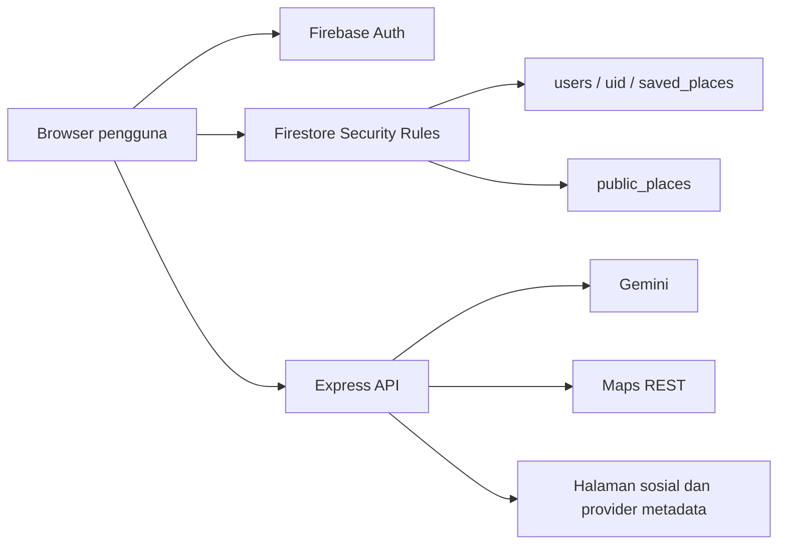

# Audit Keamanan & Arsitektur

Baseline: 6 September 2026, commit `22c26a5`. Audit source; bukan pentest deployment. Semua perbaikan di bawah adalah rekomendasi, belum diimplementasikan. Perubahan server.ts yang muncul di luar audit pada akhir sesi dijelaskan dalam dokumen 05; nomor baris mengikuti snapshot awal.

## Batas kepercayaan



Browser, caption, URL, respons provider, dan keluaran model merupakan input tidak tepercaya. Memisahkan path dengan UID tidak cukup jika aturan atau API tidak menegakkan pemiliknya.

## Daftar temuan

P0 = penghambat keamanan inti; P1 = harus diselesaikan sebelum klaim production-grade; P2 = penguatan berikutnya. Tingkat risiko berbeda dari prioritas pengerjaan.

| ID | Risiko / prioritas | Temuan dan bukti | Dampak | Perbaikan |
|---|---|---|---|---|
| SEC-01 | Kritis / P0 | [firestore.rules:6](C:/Users/rahad/Downloads/JurnalRasa/firestore.rules:6): `request.auth != null ? request.auth.uid == userId : true` | Request tanpa auth lolos ke path catatan privat yang diketahui; read/list/write/delete dalam path cocok diperbolehkan jika rules ini dipasang | Gunakan auth non-null AND owner match, default-deny, dan tes negatif |
| SEC-02 | Tinggi / P0 | [firestore.rules:11](C:/Users/rahad/Downloads/JurnalRasa/firestore.rules:11): public write tanpa syarat | Siapa pun bisa mengganti/menghapus tempat, memalsukan konten dan saveCount | Public read hanya data kurasi; write/aggregate oleh backend berotorisasi dan idempotent |
| SEC-03 | Tinggi / P0 | [server.ts:29](C:/Users/rahad/Downloads/JurnalRasa/server.ts:29), [chat:1345](C:/Users/rahad/Downloads/JurnalRasa/server.ts:1345); tidak ada middleware verifikasi Firebase token pada route berbayar | Penyalahgunaan kuota Gemini/Maps dan backend tidak mengetahui pemilik request | Verifikasi Firebase ID token sebelum request eksternal; UID berasal dari token; rate/quota limit |
| SEC-04 | Tinggi / P0 | [server.ts:402](C:/Users/rahad/Downloads/JurnalRasa/server.ts:402), [875](C:/Users/rahad/Downloads/JurnalRasa/server.ts:875) mengembalikan key Maps yang sama dengan REST backend | Credential untuk layanan server diekspos ke browser; risiko biaya bergantung restriction cloud | Hentikan pengiriman server key; selaraskan arsitektur peta dengan kebijakan proyek |
| SEC-05 | Tinggi / P0 | [App.tsx:90](C:/Users/rahad/Downloads/JurnalRasa/src/App.tsx:90), [166](C:/Users/rahad/Downloads/JurnalRasa/src/App.tsx:166), [229](C:/Users/rahad/Downloads/JurnalRasa/src/App.tsx:229): data lama tidak langsung dikosongkan saat UID berubah/sign-out | Catatan akun A berpotensi tetap terlihat oleh pengguna berikutnya selama listener baru belum selesai atau gagal; chat juga berpotensi membawa konteks lama | Kosongkan state, selectedPlace, chat, pending request; batasi cache per sesi; abaikan respons async UID lama |
| SEC-06 | Tinggi / P1 | [server.ts:118](C:/Users/rahad/Downloads/JurnalRasa/server.ts:118), [201](C:/Users/rahad/Downloads/JurnalRasa/server.ts:201), [233](C:/Users/rahad/Downloads/JurnalRasa/server.ts:233): host diperiksa dengan string includes lalu URL di-fetch | URL dengan nama platform di path/query/hostname palsu dapat mencapai fetch server; redirect dan URL gambar menambah permukaan SSRF | Parse URL; HTTPS dan hostname allowlist; validasi setiap redirect; blok jaringan privat/link-local/metadata; batasi ukuran dan waktu |
| SEC-07 | Tinggi / P1 | [App.tsx:101](C:/Users/rahad/Downloads/JurnalRasa/src/App.tsx:101), [265](C:/Users/rahad/Downloads/JurnalRasa/src/App.tsx:265): gagal anonymous auth diganti UID buatan, ada fallback guest_user | State UI dianggap autentik meski tidak ada Firebase credential; keamanan fail-open berpotensi dipertahankan demi demo | Firebase anonymous yang valid atau demo lokal terpisah; kegagalan auth menghentikan operasi cloud |
| SEC-08 | Kesenjangan wajib / P0 | [server.ts:35](C:/Users/rahad/Downloads/JurnalRasa/server.ts:35), [.env.example](C:/Users/rahad/Downloads/JurnalRasa/.env.example:1): hanya sumber env terlihat; tidak ada bukti binding Secret Manager | Requirement pengambilan secret belum dapat dinilai lulus | Lampirkan deployment secret reference, service account runtime, IAM dan versi secret; tanpa memperlihatkan value |
| SEC-09 | Sedang / P1 | [server.ts:1347](C:/Users/rahad/Downloads/JurnalRasa/server.ts:1347), [1361](C:/Users/rahad/Downloads/JurnalRasa/server.ts:1361): history/context dipercaya dari browser dan dimasukkan ke system instruction | Konteks jurnal dapat dipalsukan; prompt injection dapat mengubah rekomendasi; belum ada dasar kuat klaim “hanya jurnal pemilik” | Ambil catatan/histori berdasarkan UID terverifikasi; data untrusted terpisah dari instruction; referensi placeId tervalidasi |
| SEC-10 | Sedang / P1 | [App.tsx:333](C:/Users/rahad/Downloads/JurnalRasa/src/App.tsx:333), [448](C:/Users/rahad/Downloads/JurnalRasa/src/App.tsx:448): simpan privat sekaligus update publik dari client | Data tempat/source dibagikan otomatis; hasil privat/publik bisa tidak konsisten; counter dapat naik berulang | Privat sebagai default; publish eksplisit; whitelist field publik; unique save per UID/place |
| SEC-11 | Sedang / P1 | [App.tsx:244](C:/Users/rahad/Downloads/JurnalRasa/src/App.tsx:244), [330](C:/Users/rahad/Downloads/JurnalRasa/src/App.tsx:330): error/timeout menjadi null, toast sukses muncul sebelum hasil | Kehilangan data tertutupi; timeout tidak membatalkan write sehingga retry dapat berduplikasi | Status pending/saved/error, retry idempotent; tampilkan “tersimpan” hanya setelah ack |
| SEC-12 | Sedang / P1 | [server.ts:1348](C:/Users/rahad/Downloads/JurnalRasa/server.ts:1348), [1429](C:/Users/rahad/Downloads/JurnalRasa/server.ts:1429): validasi minimal, detail error dikembalikan | Payload salah tipe memicu error; biaya/latensi tidak dibatasi per pengguna; internals terungkap | Schema roles/content/length/count, batas token/output, deadline upstream, error publik aman + correlation ID |
| SEC-13 | Sedang / P1 | [server.ts:1444](C:/Users/rahad/Downloads/JurnalRasa/server.ts:1444), [package.json](C:/Users/rahad/Downloads/JurnalRasa/package.json:1): static root dist juga memuat server.cjs dan sourcemap | Pada mode produksi, source backend dapat terunduh melalui static handler | Pisahkan dist/client dan dist/server; hanya client menjadi static root |

### SEC-01: perilaku rules saat ini

| Konteks request | Hasil kondisi saat ini | Hasil yang seharusnya |
|---|---|---|
| Tanpa login → path milik A | true | DENY |
| Login A → path milik A | true | ALLOW untuk operasi/field sah |
| Login B → path milik A | false | DENY |
| Firebase anonymous valid → path UID sendiri | true | Sesuai kebijakan guest yang ditetapkan |

Tabel ini evaluasi logika source, **bukan hasil Firebase Emulator**. Contoh inti koreksi:

```diff
- allow read, write: if request.auth != null ? request.auth.uid == userId : true;
+ allow read, write: if request.auth != null && request.auth.uid == userId;
```

Ini hanya memperbaiki syarat kepemilikan. Tambahkan validasi field/type/size serta aturan eksplisit untuk messages dan summaries. Jangan menempel recursive owner allow yang terlalu luas jika summary seharusnya hanya boleh ditulis backend. Firestore server SDK melewati Security Rules; backend tetap wajib memeriksa ownership dan IAM. [Dokumentasi rules Firebase](https://firebase.google.com/docs/firestore/security/rules-conditions)

### SEC-03: target kontrak API

Browser mengirim `Authorization: Bearer <Firebase ID token>`. Server memverifikasi issuer/audience/expiry melalui Admin SDK; `uid` request berasal dari hasil verifikasi. Tanpa token atau token tidak sah: 401 sebelum panggilan Gemini/Maps. Token sah tetapi resource bukan miliknya: 403, atau 404 konsisten untuk mengurangi enumerasi.

Kirim `conversationId` dan pesan baru; server mengambil history milik UID tersebut. Input `userId` dari body tidak boleh menentukan lokasi penyimpanan. [Verifikasi ID token Firebase](https://firebase.google.com/docs/auth/admin/verify-id-tokens)

### SEC-04: bedakan tiga jenis key

- **Gemini key dan Maps REST server key:** rahasia backend. Dilarang dikirim dalam response, bundle, source map, log, dan pesan error.
- **Firebase web configuration:** identifier aplikasi; keberadaan `apiKey` di konfigurasi Firebase bukan otomatis kebocoran secret. Tetap perlu restrictions, Auth dan Rules yang benar. Jangan menyamakan ini dengan Gemini key. [Firebase API keys](https://firebase.google.com/docs/projects/api-keys)
- **Maps JavaScript browser key:** memang digunakan oleh browser SDK. Secara umum perlu key terpisah dan pembatasan website/API. Namun kebijakan proyek saat ini lebih ketat: semua Maps key harus server-side. Kode aktual bertentangan dengan kebijakan itu dan memakai key yang sama untuk browser serta REST. [Panduan keamanan Google Maps](https://developers.google.com/maps/api-security-best-practices)

Rekomendasi yang konsisten dengan AGENTS.md: peta tanpa Google browser SDK (misalnya Leaflet dengan tile provider yang sesuai), sementara pencarian Maps tetap melalui backend. Alternatif arsitektur browser key terpisah memerlukan keputusan eksplisit untuk merevisi kebijakan; jangan menganggap Secret Manager membuat key browser menjadi rahasia.

Restriction dan riwayat pemakaian key belum diaudit. Jika key server ini pernah diekspos di deployment, siapkan penggantian credential dan pemeriksaan penggunaan dengan migrasi terkontrol.

### SEC-06: contoh uji aman

Dalam unit test dengan fetch dimock, URL `https://example.invalid/path/instagram.com` harus ditolak sebelum koneksi. Kondisi `includes("instagram.com")` saat ini menerima substring tersebut. Uji juga hostname palsu, URL dengan userinfo, redirect ke jaringan privat, dan gambar provider yang terlalu besar. Tidak perlu mengirim payload ke metadata cloud atau sistem produksi.

### SEC-08: env bukan bukti ketidakpatuhan otomatis

Cloud Run dapat memasukkan secret dari Secret Manager sebagai environment variable. Karena itu `process.env.GEMINI_API_KEY` adalah pola yang dapat benar; tidak wajib menambahkan SDK Secret Manager jika binding deployment sudah benar. Yang belum tersedia adalah **bukti asal env, IAM, dan konfigurasi runtime**. [Secret Manager pada Cloud Run](https://cloud.google.com/run/docs/configuring/services/secrets)

### SEC-09/10: batas klaim kebocoran

Server chat saat ini tidak membaca Firestore; menerima context dari client tidak dengan sendirinya membuktikan server mengambil jurnal akun lain. Risiko yang terbukti adalah tidak adanya ownership backend dan integritas grounding, ditambah risiko state akun lama.

Payload publik yang dibaca pada dual-write tidak menyalin field `personalNotes` secara langsung. Jangan menyatakan seluruh catatan privat sudah dipublikasikan. Yang terlihat adalah publikasi otomatis metadata tempat, sourceUrl, dan ringkasan tempat, dengan aturan write terbuka.

## Kualitas data dan operasi

| Masalah | Bukti | Dampak / tindakan |
|---|---|---|
| Lokasi dan rating fallback tampak pasti | [server.ts:342](C:/Users/rahad/Downloads/JurnalRasa/server.ts:342), [372](C:/Users/rahad/Downloads/JurnalRasa/server.ts:372); rating 4.5/4.6 dan offset pusat kota | Simpan confidence/provenance; gunakan “lokasi belum terverifikasi”, null rating, dan konfirmasi pin sebelum navigasi |
| Data demo menyamar sebagai jurnal pengguna | [App.tsx:66](C:/Users/rahad/Downloads/JurnalRasa/src/App.tsx:66), [203](C:/Users/rahad/Downloads/JurnalRasa/src/App.tsx:203) | Akun kosong harus kosong; demo diberi label dan dipisahkan |
| Browser otomatis melakukan seed publik | [App.tsx:139](C:/Users/rahad/Downloads/JurnalRasa/src/App.tsx:139) | Pindahkan seed ke proses admin/dev yang disengaja |
| Deployment config tidak lengkap dalam repo | [server.ts:27](C:/Users/rahad/Downloads/JurnalRasa/server.ts:27), [1437](C:/Users/rahad/Downloads/JurnalRasa/server.ts:1437) | Baca PORT dari env dengan fallback; tetapkan NODE_ENV=production; uji cold start dan health. Port 3000 bukan otomatis salah jika service dikonfigurasi cocok |
| Model fallback belum diverifikasi di proyek | [server.ts:1395](C:/Users/rahad/Downloads/JurnalRasa/server.ts:1395) | Smoke-test model yang benar-benar tersedia; batasi retry/deadline, log model berhasil tanpa isi jurnal |
| Ketidaksesuaian kontrak docs | README menyebut places-autocomplete/details dan Leaflet; source memakai places/search, geocode, Maps JS | Sinkronkan docs dengan implementasi nyata agar juri dapat mereproduksi |

## Sudah baik

Gemini SDK dipanggil server-side; source env example tidak berisi nilai key. Ada struktur path per UID, serverTimestamp, dan rendering respons memakai react-markdown tanpa raw HTML plugin yang terlihat. Fondasi ini bisa dipertahankan, tetapi tidak menutupi aturan akses yang salah.

## Bukti penutupan minimum

Uji owner/A/B/unauth untuk setiap operasi Firestore; API 401 tanpa upstream; pergantian akun tanpa frame berisi data lama; tidak ada server secret di browser; request SSRF ditolak sebelum fetch; publikasi hanya field whitelist; write gagal terlihat gagal; setiap temuan P0 punya hasil tes dan bukti deployment yang cocok.
